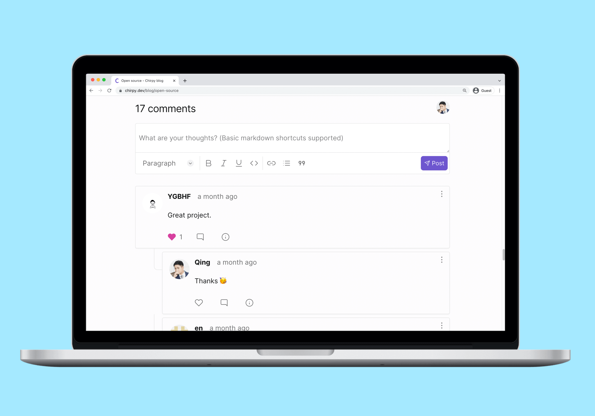
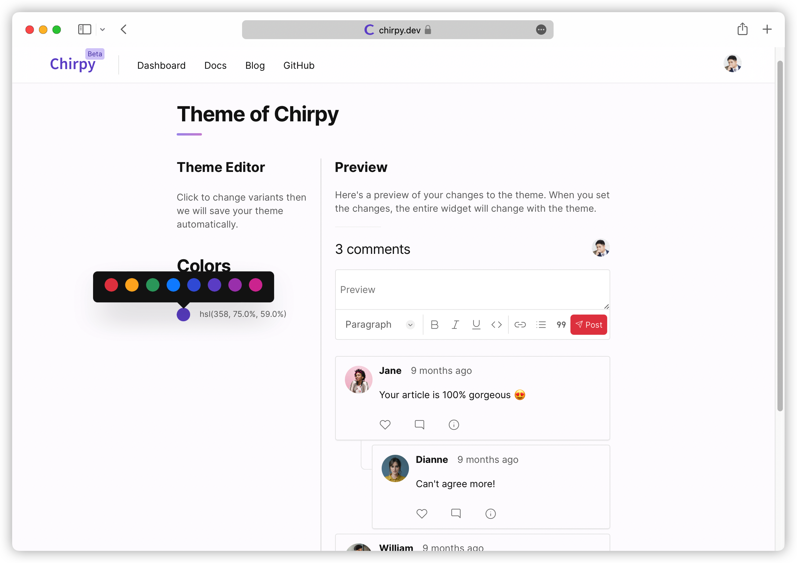
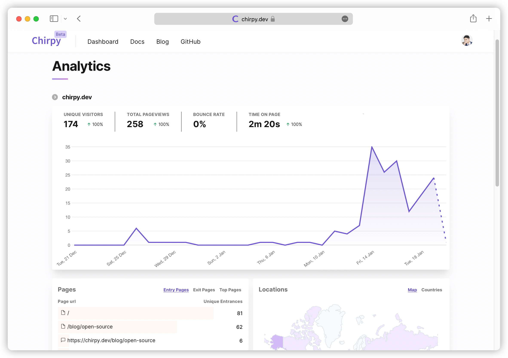
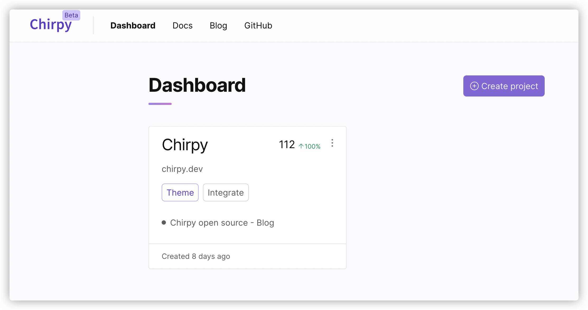
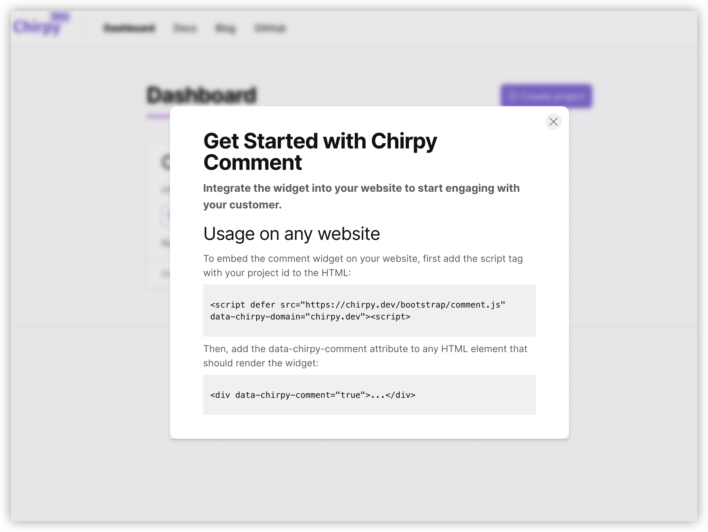

# Chirpy

👋 [Chirpy](https://chirpy.dev) is a privacy-friendly and customizable Disqus(comment system) alternate. Read our [open source](https://chirpy.dev/blog/open-source) announcement.

    
More screenshots

    
    
    
    

 

Like what you see? Give Chirpy a GitHub Star ⭐, it will help us a lot!

## ✨ Key features

- 🔒 Privacy friendly
- 🎨 [Customizable widget](https://chirpy.dev/docs/features/theme)
- ⚡️ Reasonably fast
- ✍️ Rich Text Formatting & [Markdown shortcuts](https://chirpy.dev/docs/features/markdown)
- 📊 [Widget analytics](https://chirpy.dev/docs/features/analytics)
- 🪄 Real-time comments
- 📱 Mobile friendly
- 🔔 Email & Web notifications
- 🤐 [Anti toxic comment](https://chirpy.dev/docs/features/anti-toxic-comment)
- 💬 [Comment moderation](https://chirpy.dev/docs/features/moderation) -->

## 🧭 Roadmap

We're working hard to make Chirpy General Available first. Here are the blocking features:

- ~~[Notifications](https://github.com/devrsi0n/chirpy/issues/134)~~
- Account plan
- Payment
- Email login without password

## 📀 Self-hosted

You can have a [self-hosted](https://chirpy.dev/docs/self-hosted) version of Chirpy. Both the Cloud and self-hosted versions are equal. You need a server to install, run and maintain a Chirpy instance.

## 🍡 Tech stacks

- 
- 
- 
- 
- 
- 
- 
- [urql](https://github.com/FormidableLabs/urql)
- [next-auth](https://github.com/nextauthjs/next-auth)
- [tiptap](https://tiptap.dev)
- [Plausible](https://github.com/plausible/analytics)

## 🥇 Contribution

You're welcome to contribute to this project. Please follow the [CONTRIBUTING](CONTRIBUTING.md) guide.

## 🚀 Hosting platforms

## 💅 Design system

- Colors comes from [radix color](https://www.radix-ui.com/colors)
- Home hero section inspired by [stitches](https://stitches.dev/)

## ⚖️ License

The Apache License.
