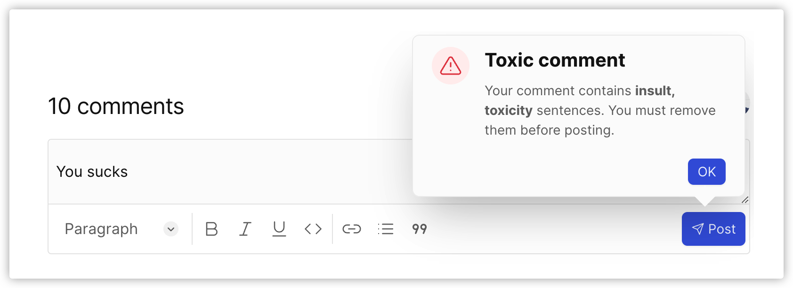

# Chirpy | [简体中文](./README-zh.md)

👋 [Chirpy](https://chirpy.dev) is a privacy-friendly and customizable Disqus(comment system) alternate. Try it now: [Playground](https://chirpy.dev/play).

    
More screenshots

    
    
    
    
    
    
    

 

Like what you see? Give Chirpy a GitHub Star ⭐, it will help us a lot!

## ✨ Key features

- 🔒 Privacy-friendly
- 🎨 [Customizable widget](https://chirpy.dev/docs/features/theme)
- ✍️ Rich Text Formatting & [Markdown shortcuts](https://chirpy.dev/docs/features/markdown)
- 📊 [Widget analytics](https://chirpy.dev/docs/features/analytics)
- 🪄 Real-time comments
- 📱 Mobile friendly
- 🔔 [Email & Web push notifications](https://chirpy.dev/docs/features/notifications)
- 🤐 [Anti-toxic comment](https://chirpy.dev/docs/features/anti-toxic-comment)
- 💬 [Comment moderation](https://chirpy.dev/docs/features/moderation)
- 🎭 [Anonymous sign-in](https://chirpy.dev/docs/features/privacy-friendly#anonymous-sign-in)
- 📬 [Email/magic link sign-in](https://chirpy.dev/docs/features/privacy-friendly#email-sign-in)

## 🧭 Roadmap

Although Chirpy is ready to serve you and your users, we're working hard to add more features:

- More custom options
- Account plan
- Payment

## 📀 Self-hosted

You can have a [self-hosted](https://chirpy.dev/docs/self-hosted) version of Chirpy. Both the Cloud and self-hosted versions are equal. You need 2 servers and 2 domains to install, run and maintain multiple instances.

## 🍡 Tech stacks

- 
- 
- 
- 
- 
- 
- 
- [urql](https://github.com/FormidableLabs/urql)
- [next-auth](https://github.com/nextauthjs/next-auth)
- [tiptap](https://tiptap.dev)
- [Plausible](https://github.com/plausible/analytics)

## 🥇 Contribution

You're welcome to contribute to this project. Please follow the [CONTRIBUTING](CONTRIBUTING.md) guide.

## 🚀 Hosting platforms

## 💅 Design system

- Colors come from [radix color](https://www.radix-ui.com/colors)
- Home hero section is inspired by [stitches](https://stitches.dev/)

## ⚖️ License

AGPL 3.0
