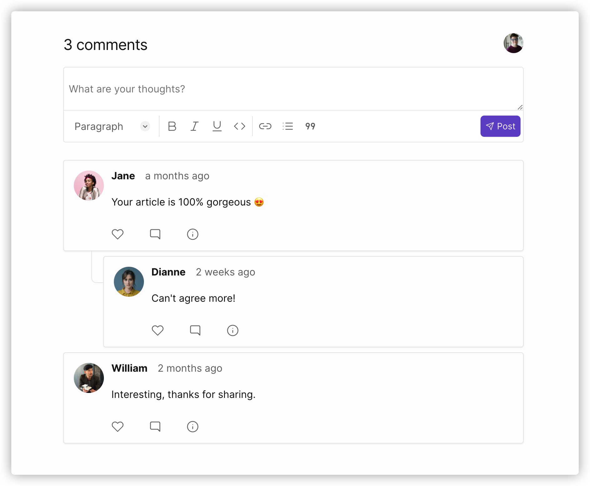

# Chirpy

<!--  -->

</img>

👋 [Chirpy](https://chirpy.dev) is a privacy-friendly and customizable Disqus alternate. Read our [open source](https://chirpy.dev/blog/open-source) announcement.

## Key features

- 🔒 Privacy friendly
- ⚡️ Reasonably fast
- 🎨 Customizable widget
- ✍️ Markdown shortcuts & Rich Text Formatting
- 📈 Widget analytics

## Tech stacks

- [TypeScript](https://www.typescriptlang.org/)
- [Next.js](https://github.com/vercel/next.js)
- [GraphQL](https://graphql.org/) & [Hasura/graphql-engine](https://github.com/hasura/graphql-engine) & [Apollo Client](https://github.com/apollographql/apollo-client)
- [tailwindcss](https://tailwindcss.com/) & [twin.macro](https://github.com/ben-rogerson/twin.macro)
- [next-auth](https://github.com/nextauthjs/next-auth)
- [Plausible](https://github.com/plausible/analytics)

## Contribution

You're welcome to contribute to this project. Please follow the [CONTRIBUTING](CONTRIBUTING.md) guide.

## [Self-hosted](https://chirpy.dev/docs//self-hosted)

## Roadmap

We're working hard to make Chirpy General Available first. Here are the blocking features:

- Email notification
- Email login without password
- Account plan

## Hosting platforms

## License

The Apache License.
